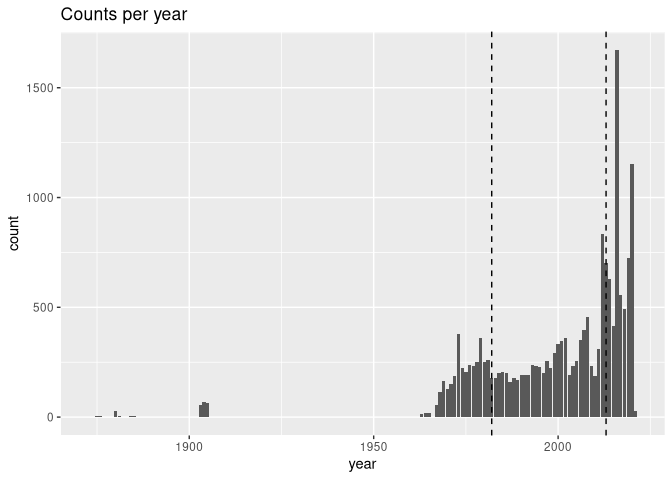
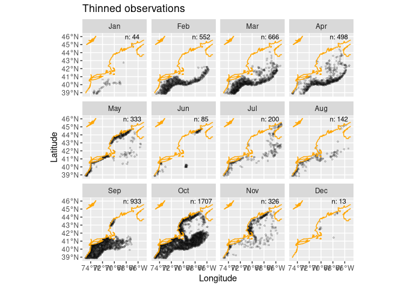
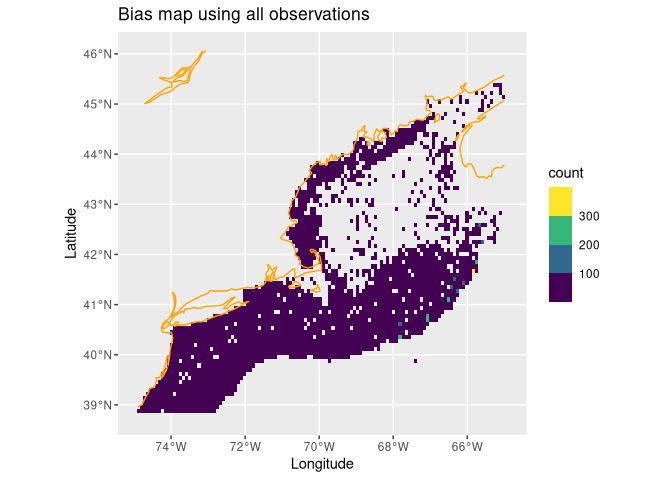
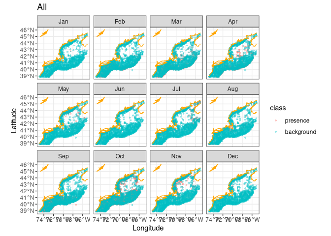
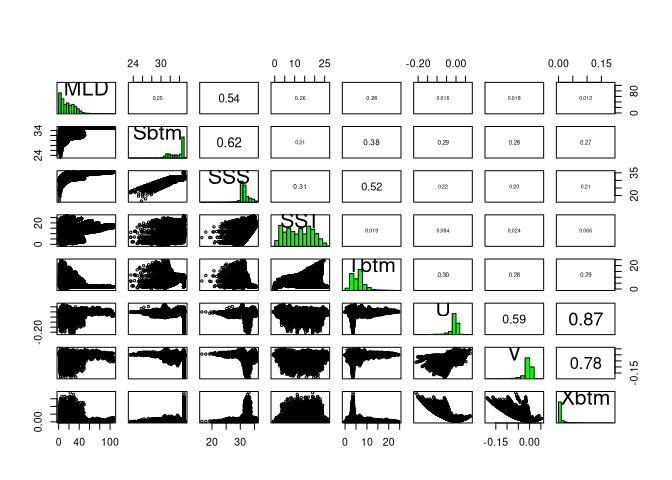

C03_assignment.Rmd
================

\#set up r and name species

## Read species

``` r
obs = read_obis(SPECIES2)
obs
```

    ## Simple feature collection with 18108 features and 7 fields
    ## Geometry type: POINT
    ## Dimension:     XY
    ## Bounding box:  xmin: -74.9 ymin: 38.8 xmax: -65.0485 ymax: 45.4147
    ## Geodetic CRS:  WGS 84
    ## # A tibble: 18,108 × 8
    ##    id             basisOfRecord eventDate   year month eventTime individualCount
    ##  * <chr>          <chr>         <date>     <dbl> <chr> <chr>               <dbl>
    ##  1 000201d4-c544… HumanObserva… 2006-03-31  2006 Mar   <NA>                    5
    ##  2 00101959-22e5… HumanObserva… 1986-10-05  1986 Oct   <NA>                 1649
    ##  3 00154ef1-667e… HumanObserva… 2016-03-08  2016 Mar   <NA>                   NA
    ##  4 001b0694-40f3… HumanObserva… 1985-10-10  1985 Oct   <NA>                  385
    ##  5 001eba7a-6c48… HumanObserva… 2016-03-07  2016 Mar   <NA>                   NA
    ##  6 00219cae-5e5b… HumanObserva… 1989-09-20  1989 Sep   <NA>                  648
    ##  7 00224f38-7a29… HumanObserva… 2013-03-15  2013 Mar   <NA>                   NA
    ##  8 002ddd98-9c2a… HumanObserva… 2016-02-26  2016 Feb   <NA>                   NA
    ##  9 002fb001-01c3… HumanObserva… 2016-02-26  2016 Feb   <NA>                   NA
    ## 10 00376007-def9… HumanObserva… 2020-03-02  2020 Mar   <NA>                   NA
    ## # ℹ 18,098 more rows
    ## # ℹ 1 more variable: geom <POINT [°]>

This is an R Markdown format used for publishing markdown documents to
GitHub. When you click the **Knit** button all R code chunks are run and
a markdown file (.md) suitable for publishing to GitHub is generated.

## Summary of observations

You can include R code in the document as follows:

``` r
summary(obs)
```

    ##       id            basisOfRecord        eventDate               year     
    ##  Length:18108       Length:18108       Min.   :1873-08-02   Min.   :1873  
    ##  Class :character   Class :character   1st Qu.:1987-09-21   1st Qu.:1987  
    ##  Mode  :character   Mode  :character   Median :2006-03-28   Median :2006  
    ##                                        Mean   :2000-04-15   Mean   :2000  
    ##                                        3rd Qu.:2016-02-25   3rd Qu.:2016  
    ##                                        Max.   :2021-11-16   Max.   :2021  
    ##                                        NA's   :15           NA's   :15    
    ##     month            eventTime         individualCount              geom      
    ##  Length:18108       Length:18108       Min.   :    1.0   POINT        :18108  
    ##  Class :character   Class :character   1st Qu.:    8.0   epsg:4326    :    0  
    ##  Mode  :character   Mode  :character   Median :   55.0   +proj=long...:    0  
    ##                                        Mean   :  422.9                        
    ##                                        3rd Qu.:  309.0                        
    ##                                        Max.   :27589.0                        
    ##                                        NA's   :8185

\#filter out na values in dataset

``` r
obs = obs |>
  filter(!is.na(eventDate))
summary(obs)
```

    ##       id            basisOfRecord        eventDate               year     
    ##  Length:18093       Length:18093       Min.   :1873-08-02   Min.   :1873  
    ##  Class :character   Class :character   1st Qu.:1987-09-21   1st Qu.:1987  
    ##  Mode  :character   Mode  :character   Median :2006-03-28   Median :2006  
    ##                                        Mean   :2000-04-15   Mean   :2000  
    ##                                        3rd Qu.:2016-02-25   3rd Qu.:2016  
    ##                                        Max.   :2021-11-16   Max.   :2021  
    ##                                                                           
    ##     month            eventTime         individualCount              geom      
    ##  Length:18093       Length:18093       Min.   :    1.0   POINT        :18093  
    ##  Class :character   Class :character   1st Qu.:    8.0   epsg:4326    :    0  
    ##  Mode  :character   Mode  :character   Median :   55.0   +proj=long...:    0  
    ##                                        Mean   :  423.2                        
    ##                                        3rd Qu.:  309.0                        
    ##                                        Max.   :27589.0                        
    ##                                        NA's   :8176

## plot of observation

<!-- --> \#load data

``` r
coast = read_coastline()
obs = read_observations(scientificname = "Doryteuthis pealeii")
db = brickman_database() |>
  filter(scenario == "STATIC", var == "mask")
mask = read_brickman(db)
```

\#change coordintes of observation

``` r
LON0 = -67
LAT0 = 46
all_counts = count(st_drop_geometry(obs), month)
all_counts
```

    ## # A tibble: 12 × 2
    ##    month     n
    ##    <fct> <int>
    ##  1 Jan      48
    ##  2 Feb    2264
    ##  3 Mar    4626
    ##  4 Apr     765
    ##  5 May     866
    ##  6 Jun     210
    ##  7 Jul    1225
    ##  8 Aug     207
    ##  9 Sep    2306
    ## 10 Oct    4424
    ## 11 Nov     496
    ## 12 Dec      13

\#GG plot created for species observation presence

``` r_ggplot
ggplot() +
  geom_sf(data = obs, alpha = 0.2, shape = "circle small", size = 1) +
  geom_sf(data = coast, col = "green") +
  geom_text(data = all_counts,
            mapping = aes(x = LON0, 
                          y = LAT0, 
                          label = sprintf("n: %i", .data$n)),
                          size = 3) + 
  labs(x = "Longitude", y = "Latitude", title = "All observations") +
  facet_wrap(~month)
```

\#thin observations filtering out months without data (should be none)

``` r
thinned_obs = sapply(month.abb,
               function(mon){ 
                 thin_by_cell(obs |> filter(month == mon), mask)
               }, simplify = FALSE) |>
  dplyr::bind_rows() 
thinned_counts = count(st_drop_geometry(thinned_obs), month)

ggplot() +
  geom_sf(data = thinned_obs, 
          alpha = 0.2, 
          shape = "circle small", 
          size = 1) +
  geom_sf(data = coast, col = "orange") +
  geom_text(data = thinned_counts,
            mapping = aes(x = LON0, 
                          y = LAT0, 
                          label = sprintf("n: %i", .data$n)),
                          size = 3) + 
  labs(x = "Longitude", y = "Latitude", title = "Thinned observations") +
  facet_wrap(~month)
```

<!-- -->
\#ggplot bias map

``` r
bias_map = rasterize_point_density(obs, mask) 

ggplot() +
  geom_stars(data = bias_map, aes(fill = count)) +
  scale_fill_viridis_b(na.value = "transparent") +
  geom_sf(data = coast, col = "orange") + 
  labs(x = "Longitude", y = "Latitude", title = "Bias map using all observations")
```

<!-- --> \#explore
background

``` r
nback_avg = mean(all_counts$n) |>
  round()
nback_avg
```

    ## [1] 1454

\#sample of background

``` r
obsbkg = sapply(month.abb,
    function(mon){ 
      sample_background(thinned_obs |> filter(month == mon), # <- just this month
                       bias_map,
                       method = "bias",  # <-- it needs to know it's a bias map
                       return_pres = TRUE, # <-- give me the obs back, too
                       n = nback_avg) |>   # <-- how many points
        mutate(month = mon, .before = 1)
    }, simplify = FALSE) |>
  bind_rows() |>
  mutate(month = factor(month, levels = month.abb))
obsbkg 
```

    ## Simple feature collection with 22947 features and 2 fields
    ## Geometry type: POINT
    ## Dimension:     XY
    ## Bounding box:  xmin: -74.9 ymin: 38.84435 xmax: -65.02004 ymax: 45.4147
    ## Geodetic CRS:  WGS 84
    ## # A tibble: 22,947 × 3
    ##    month class                geometry
    ##  * <fct> <fct>             <POINT [°]>
    ##  1 Jan   presence      (-68.46 42.755)
    ##  2 Jan   presence (-69.23333 40.16667)
    ##  3 Jan   presence (-73.06867 38.90267)
    ##  4 Jan   presence       (-69.85 40.25)
    ##  5 Jan   presence    (-71.51667 40.15)
    ##  6 Jan   presence   (-73.43817 38.895)
    ##  7 Jan   presence (-73.33333 39.13333)
    ##  8 Jan   presence     (-71.41667 40.3)
    ##  9 Jan   presence  (-72.75133 39.1165)
    ## 10 Jan   presence  (-73.4395 38.98933)
    ## # ℹ 22,937 more rows

\#check tallying for each month

``` r
count(st_drop_geometry(obsbkg), month, class)
```

    ## # A tibble: 24 × 3
    ##    month class          n
    ##    <fct> <fct>      <int>
    ##  1 Jan   presence      44
    ##  2 Jan   background  1454
    ##  3 Feb   presence     552
    ##  4 Feb   background  1454
    ##  5 Mar   presence     666
    ##  6 Mar   background  1454
    ##  7 Apr   presence     498
    ##  8 Apr   background  1454
    ##  9 May   presence     333
    ## 10 May   background  1454
    ## # ℹ 14 more rows

\#ggplot background

``` r
ggplot() +
  geom_sf(data = obsbkg, 
          mapping = aes(col = class),
          alpha =  0.4, shape = "circle small", size = 1) +
  geom_sf(data = coast, col = "orange")  + 
  labs(x = "Longitude", y = "Latitude", title = "All") +   
  theme_bw() + 
  scale_fill_okabe_ito() +  
  facet_wrap(~month)
```

<!-- -->

\#creating model for species

``` r
write_model_input(obsbkg, scientificname = "Doryteuthis pealeii")
```

\#save model

``` r
x = read_model_input(scientificname = "Doryteuthis pealeii")
```

\#generate variables in brickman database

``` r
db = brickman_database() |>
  dplyr::filter(scenario == "PRESENT", interval == "mon")
present = read_brickman(db)
```

\#generate pairs plot for variables in brickman database
vs. observations

``` r
pairs(present)
```

<!-- --> \#filter
significant correlation values

``` r
keep = filter_collinear(present, method = "cor_caret", cutoff = 0.65)
keep
```

    ## [1] "SSS"  "U"    "Sbtm" "V"    "Tbtm" "MLD"  "SST" 
    ## attr(,"to_remove")
    ## [1] "Xbtm"
